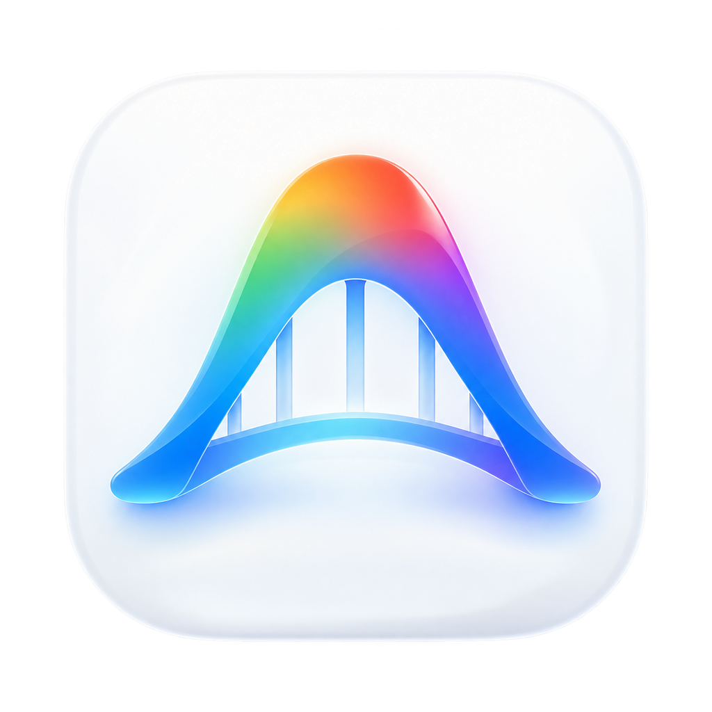

# AG Bridge



AG Bridge 是一个轻量的 macOS 启动器：自动识别本机 HTTP/Mixed 或 SOCKS5 代理，并只为 Antigravity 进程树注入代理环境，**无需开启 TUN，也不会修改系统代理**。

> [!IMPORTANT]
> 本项目是独立的非官方开源项目，与 Google 没有隶属、赞助或背书关系。
> 项目基于 MIT License 授权的 [Antigravity Bridge](https://github.com/anzaiyes/AntigravityBridge)（作者：安仔）改造而来，
> 来源与归属说明见 [NOTICE](NOTICE.md)。

## 相比上游做了什么

上游 [Antigravity Bridge](https://github.com/anzaiyes/AntigravityBridge) 的 v2.2.0 只支持 Bundle ID 为 `com.google.antigravity-ide` 的 **Antigravity IDE**。但 Google 后来把 Antigravity 拆成了两个独立 App，本机只装 agent manager 的话，上游版本会直接「找不到 Antigravity」。

AG Bridge 在这一版做了以下改造（完整清单见 [与上游的差异](docs/与上游的差异.md)）：

| 改动 | 说明 |
| --- | --- |
| **同时支持两个 Antigravity App** | `com.google.antigravity-ide`（IDE）与 `com.google.antigravity`（agent manager）都认 |
| **修复启动器永久卡死** | 上游按 AppleScript 应用名判断运行状态，名字对不上时 `osascript` 会一直阻塞；现改为按可执行文件路径探测 |
| **全新品牌** | 应用名、Bundle ID、图标、全部用户可见文案 |
| **图标更完整** | 补齐 16→1024 共 10 个尺寸（含 @2x），上游只有 5 个 |
| **新增命令行参数** | `--version`、`--help` |
| **配置迁移更全** | 上游 `Antigravity Bridge` 与更早的 `Antigravity Proxy` 两条旧路径都能自动迁移 |
| **测试更严** | 新增双 Bundle ID、无关 Bundle 拒绝、旧配置迁移、版本号一致性等用例 |

## 功能

- 自动读取 macOS 系统代理以及 Clash、Mihomo、Surge 的常见配置。
- 实际验证代理端口和目标端点后给出可解释的推荐。
- 支持手动配置本机 HTTP/Mixed 或 SOCKS5 端口。
- 仅影响由启动器打开的 Antigravity 进程树。
- 不开启 TUN，不修改系统路由、代理客户端或 Antigravity 应用。
- 保存每个 macOS 用户各自的配置，代理失效后自动重新探测。

## 系统要求

- macOS 12 或更高版本。
- 已安装 Antigravity IDE（`com.google.antigravity-ide`）或 Antigravity（`com.google.antigravity`）。
- 本机已有可用的 HTTP/Mixed 或 SOCKS5 代理（例如 Clash、Mihomo、Surge 等客户端已启动）。

> AG Bridge **本身不提供代理**，也不是代理客户端。它只负责把「你已有的本机代理」注入给 Antigravity。
> 没有代理客户端、或者没有安装 Antigravity 时，启动器会明确提示并退出。

本项目使用 macOS 自带的 Bash 3.2、`curl`、`nc`、`plutil`、`osascript` 和 `open`，运行时不需要安装第三方依赖。

## 安装

1. 从 [Releases](https://github.com/a916791360/ag-bridge/releases) 下载安装包以及 `SHA256SUMS`。若该版本提供 `.dmg`，可以在镜像中直接将 App 拖入 `Applications`；否则下载 `.zip` 并解压。
2. 核对下载文件的 SHA-256：

   ```bash
   shasum -a 256 -c SHA256SUMS
   ```

3. 解压后，将 `AG Bridge.app` 拖入 `/Applications`。
4. 确保代理客户端正在运行，并用 `Command-Q` 完全退出已经打开的 Antigravity。
5. 首次启动时右键 App 并选择“打开”。如果 macOS 仍然阻止启动，请前往“系统设置 → 隐私与安全性”，点“仍要打开”。

   或者在终端里执行下面这行，直接去掉下载隔离标记（效果等同，适合习惯命令行的同学）：

   ```bash
   xattr -dr com.apple.quarantine "/Applications/AG Bridge.app"
   ```

### 关于签名与 Gatekeeper

当前 v1.0.0 发布包采用 ad-hoc 签名，尚未使用 Apple Developer ID 签名，也没有经过 Apple 公证。macOS 因此可能显示“无法验证开发者”等提示。请只从本项目的官方 GitHub Releases 下载，并核对 SHA-256。

不要为了运行本项目而全局关闭 Gatekeeper。

## 使用

首次运行时，启动器会查找 Antigravity、检测可用代理，并显示推荐项。选择后配置保存在：

```text
~/Library/Application Support/AG Bridge/config.plist
```

从上游 Antigravity Bridge 或更早的 Antigravity Proxy 升级时，旧配置会在首次运行时自动复制到新目录，旧配置不会被删除。

> **重要**：以后每次都要从这个启动器打开 Antigravity。直接双击 Antigravity 本身的图标不会带代理。

### 每次启动前，务必先退出 Antigravity

Antigravity 是 Electron 应用，有**单实例机制**：`--proxy-server` 只在进程启动那一刻生效，**没法给一个已经在跑的实例补加**。

所以启动器会先检测目标 App 是否在运行。**如果在运行，它会直接弹窗提示并退出（退出码 1），不会静默失败**：

> Antigravity 已在运行，无法为现有进程补加代理。请先用 Command-Q 完全退出 Antigravity，再点击本启动器。

正确顺序永远是：**先 `Command-Q` 完全退出 Antigravity → 再双击 AG Bridge**。

想确认这一次到底有没有注入成功，执行：

```bash
pgrep -lf "proxy-server=http" | cut -c1-240
```

有输出表示注入生效（能看到 `--proxy-server=http://127.0.0.1:<端口>`）；没有任何输出表示这次不是启动器拉起来的，退回上一步重来。

主动重新配置：

```bash
"/Applications/AG Bridge.app/Contents/MacOS/ag-bridge" --configure
```

查看自动发现结果：

```bash
"/Applications/AG Bridge.app/Contents/MacOS/ag-bridge" --diagnose
```

查看版本与全部参数：

```bash
"/Applications/AG Bridge.app/Contents/MacOS/ag-bridge" --version
"/Applications/AG Bridge.app/Contents/MacOS/ag-bridge" --help
```

更完整的说明见 [使用说明](docs/使用说明.md)。

## 隐私与网络行为

为了发现本机代理，启动器可能读取：

- macOS 当前系统代理设置。
- Clash、Mihomo 和 Surge 的常见本地配置文件。
- 保存于本机的 AG Bridge 配置。

为了验证代理可用性，启动器会通过候选代理访问：

- `https://www.gstatic.com/generate_204`
- `https://daily-cloudcode-pa.googleapis.com/`

启动器不会读取、保存或转发 Google 登录凭据，也不包含遥测服务。配置文件权限设置为仅当前用户可读写。

## 从源码构建

```bash
./scripts/build.sh
./tests/run-tests.sh
./scripts/package.sh v1.0.0
```

生成产物位于 `dist/`：

```text
dist/AG Bridge.app
dist/AG-Bridge-v1.0.0-unsigned.zip
dist/AG-Bridge-v1.0.0-unsigned.dmg
dist/SHA256SUMS
```

如果本机安装了 ShellCheck，测试脚本也会自动执行静态检查。正式发布流程见 [发布流程](docs/发布流程.md)。

## 项目结构

- `src/ag-bridge`：启动器 Bash 源码。
- `packaging/Info.plist`：macOS App Bundle 元数据。
- `resources/`：App 图标资源。
- `scripts/`：构建、打包以及可选签名脚本。
- `tests/`：自动化测试和配置 fixture。
- `docs/`：使用、设计和发布文档。
- `.github/workflows/`：持续集成和标签发布流程。

## 卸载

删除 `/Applications/AG Bridge.app`。如需同时删除本地配置，再删除：

```text
~/Library/Application Support/AG Bridge/
```

卸载不会更改 Antigravity 或代理客户端。

## 参与贡献与安全报告

提交代码前请阅读 [贡献指南](CONTRIBUTING.md)。安全问题请遵循 [安全策略](SECURITY.md)，不要在公开 Issue 中披露漏洞细节。

## 许可证与归属

本项目使用 [MIT License](LICENSE)。

- 上游 Antigravity Bridge：Copyright (c) 2026 安仔 — https://github.com/anzaiyes/AntigravityBridge
- AG Bridge 改造与品牌化：Copyright (c) 2026 a916791360

品牌与归属说明见 [NOTICE](NOTICE.md)。
