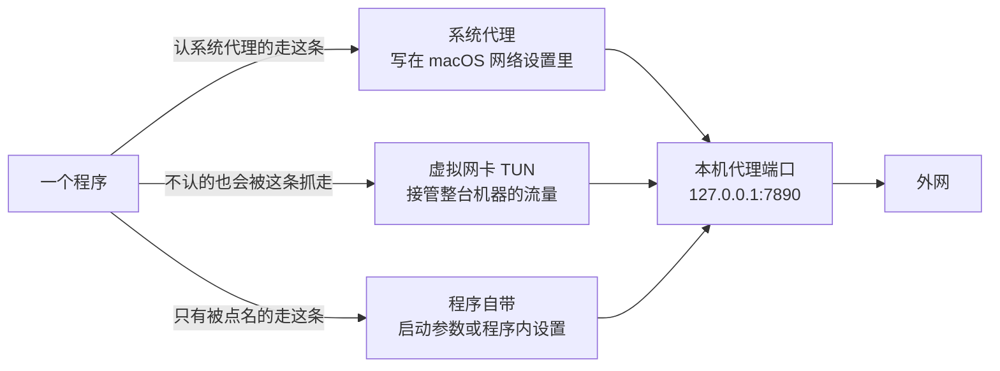
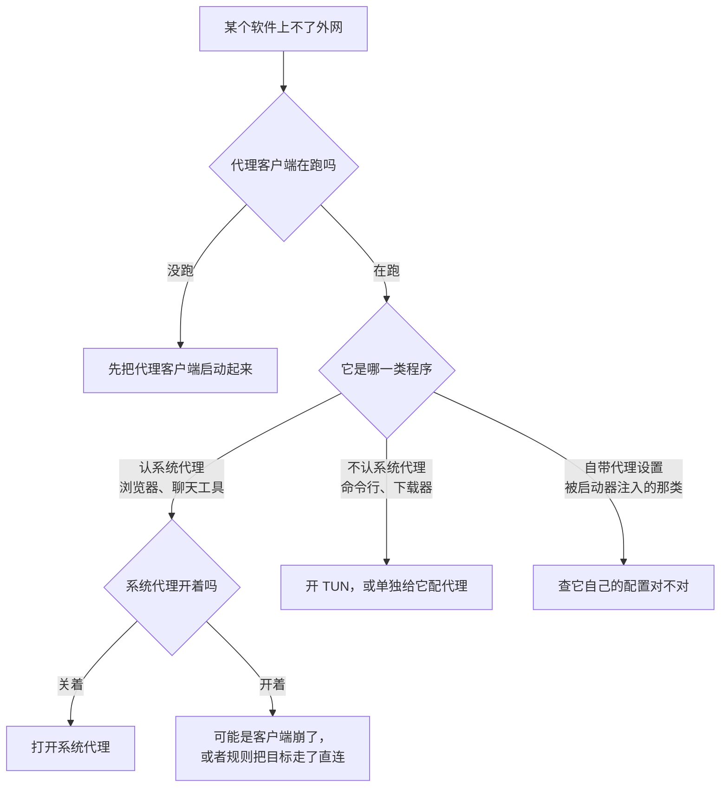

# 为什么有的软件能上外网，有的不能

> 这是一份写给普通用户的科普。
>
> 起因很具体：一台 Mac 上，Chrome 打不开 ChatGPT，但 Antigravity（一个 IDE）却能正常进。同一台电脑、同一个网络、同一时刻，结果完全不同。本文把这件事讲清楚。
>
> 全文所有数字都是在那台机器上实测出来的，不是推测。命令都是复制就能跑的，你可以拿自己的机器对一遍。

---

## 一、先记住一句话

**"代理"不是一个开关，而是三条不同的路。**

每一个程序可以走不同的路，所以"同一个电脑上，有的软件能上、有的不能"完全是正常现象——不是你的电脑坏了，也不是它"特殊"。

---

## 二、三条路分别是什么



### 路线 1 · 系统代理

代理客户端把 `127.0.0.1:7890` 这样的地址**写进 macOS 的网络设置**里。之后，凡是主动来读这套设置的程序，就自动走代理。

- **谁走这条路**：Safari、Chrome、大多数 Electron 应用（VS Code、Slack、钉钉……）、系统更新。
- **谁不走**：命令行工具（`curl`、`git`、`pip`、`npm`）、部分游戏、Docker、部分下载器。它们压根不看系统设置。
- **影响面**：只影响"认这套设置"的程序，其余直连。
- **优点**：最省事，开一个开关就够。
- **坑**：这个设置是**持久化在系统里**的。见第五节。

### 路线 2 · 虚拟网卡（TUN）

代理客户端在系统里造一块假的网卡，**把所有出网流量都从它这儿过一遍**。程序自己怎么想不重要，反正路被接管了。

- **谁走这条路**：全都走，包括那些不认系统代理的命令行工具。
- **影响面**：全局。
- **优点**：无差别覆盖，专治"某个软件死活不认代理"。
- **坑**：会改路由表和 DNS。分流规则如果不是你想要的，会出现"国内网站也绕出国转一圈"的情况。部分企业 VPN、虚拟机、局域网设备可能受影响。

### 路线 3 · 程序自带

程序自己就知道代理在哪儿，不需要问系统。常见两种形式：

- **启动参数**：拉起进程时在命令行里塞 `--proxy-server=http://127.0.0.1:7890`。
- **程序内设置**：软件自己的偏好设置里填代理地址。

AG Bridge 用的就是第一种——这也是它的全部原理。

- **影响面**：严格只影响被点名的那个程序，最干净。
- **优点**：不动系统设置，不管 TUN、不管系统代理，其他软件完全不被打扰。
- **坑**：每个程序要单独配；只能在**启动那一刻**加进去，跑起来了就补不上（见第四节）。

### 三条路对比

| | 系统代理 | TUN | 程序自带 |
| --- | --- | --- | --- |
| 覆盖范围 | 认这套设置的程序 | 全部程序 | 只有被点名的程序 |
| 要不要改系统 | 要 | 要（改路由和 DNS） | 不要 |
| 命令行工具能用吗 | ❌ | ✅ | 看程序自身 |
| 客户端崩了的后果 | **全网断**（见第五节） | 网络恢复直连，影响较小 | 无影响 |
| 适合谁 | 日常上网的普通人 | 什么都得走代理的重度用户 | 只想让某一个软件走 |

---

## 三、回到那个现象：为什么浏览器上不去，它却能上

那台机器的实测数据是这样的：

**系统层**：系统代理三个开关（HTTP / HTTPS / SOCKS）**全是关的**，虚拟网卡（TUN）**也是关的**。

所以整台机器在系统层面是"裸奔"状态——没有任何一条路是给普通程序准备好的。

**程序层**，两条路的对比：

| | Antigravity | Chrome |
| --- | --- | --- |
| 命令行 | 带 `--proxy-server=http://127.0.0.1:7890` | 不带任何代理参数 |
| 怎么找代理 | 参数写死在进程里，不问系统 | 去读 macOS 系统设置 |
| 读到的东西 | 7890，有效 | 空 |
| 结果 | 全部连接走代理，能上 | 全部直连，21 个连接卡在 `SYN_SENT` |
| 直连测试 | — | google.com / chatgpt.com 均无响应（`000`） |

`SYN_SENT` 的意思是：请求发出去了，对方一直没回应。典型的被拦特征。

**所以结论是**：不是这台电脑"特殊"，而是那个程序被单独赋予了代理，成了唯一一个不需要系统代理就能上网的例外。

> 顺带说明：Antigravity 是 Electron 应用，基于 Chromium。Chromium 的既定规则是**命令行里的 `--proxy-server` 优先于系统设置**。所以就算你把系统代理也打开，它依然只用被注入的那一个，不会"双跳"。

---

## 四、Electron 应用的一个特性：跑起来了就补不上

这解释了一个很常见的困惑——"我明明点了启动器，怎么没生效？"

Antigravity 这类 Electron 应用有**单实例机制**：第二个实例启动时会发现"已经有一个我在跑了"，于是把参数交给老实例、自己退出。**而老实例忽略这些新参数。**

也就是说，`--proxy-server` 只在进程**启动那一刻**读一次。已经在跑的程序，没法事后给它补加代理。

正确顺序永远是：

1. 代理客户端开着；
2. **`Command-Q` 把目标程序完全退干净**（不是关窗口，是完全退出）；
3. 再点启动器。

AG Bridge 会在拉起前检测目标是否在运行，如果在运行就弹窗提示并退出——不会让你以为成功了。

---

## 五、系统代理最大的坑：客户端崩了 = 全网断

这是"突然连百度都打不开"最常见的原因，值得单独说。

系统代理是**持久化写在 macOS 网络设置里**的。当你打开它，系统里就留下了"所有请求都去 `127.0.0.1:7890`"这条规则。

如果此时代理客户端**崩溃、被强杀、或者你手滑退出了**——7890 端口上没人监听——那么所有认系统代理的程序都会去敲一个空门：

- 浏览器打不开任何网页，**包括百度**；
- 系统更新、App Store 一起歇。

看起来像"全网断了"，其实只是代理客户端没了、而设置还留着。

**兜底命令**（把系统代理关掉，网络立刻恢复直连）：

```bash
for s in "USB 10/100/1000 LAN" "Thunderbolt Bridge" "Wi-Fi" "iPhone USB"; do
  networksetup -setwebproxystate "$s" off
  networksetup -setsecurewebproxystate "$s" off
  networksetup -setsocksfirewallproxystate "$s" off
done
scutil --proxy | grep Enable    # 全部回 0 就好了
```

> 网络服务的名字因人而异，先用 `networksetup -listallnetworkservices` 看你机器上都有哪些，再替换进去。

**建议**：如果只是想让浏览器和聊天工具能上外网，打开「系统代理」就够，别动 TUN。记得让代理客户端开机自启、别随手强杀。

---

## 六、两个特别容易骗到人的地方

### 1. "系统代理关着" ≠ "没有程序在走代理"

那台机器上系统代理是关的，但实测仍有 **18 条活连接**挂在 7890 上：

| 程序 | 活连接数 |
| --- | --- |
| WorkBuddy（Electron） | 13 |
| Hermes agent | 2 |
| 语界 | 1 |
| 钉钉 | 1 |
| Safari 的网络进程 | 1 |
| Chrome | 1 |

原因是这些程序**自己持有或缓存了代理配置**，不经过系统开关。所以"看系统设置"永远只能得到一半的真相。

### 2. 想知道"程序眼里是什么样"，要问对地方

`scutil --proxy` 读的是**系统设置本身**。而程序实际怎么走，取决于它读到的结果——macOS 上大部分程序是走 CFNetwork 这一层的。

要预测程序的真实行为，用这条：

```bash
env -u http_proxy -u https_proxy -u ALL_PROXY -u all_proxy \
  python3 -c "from urllib.request import getproxies_macosx_sysconf as f; print(f() or '空 → 直连')"
```

- 输出 `{}` 以外的内容 = 程序会走那个代理；
- 输出「空 → 直连」= 程序会去直连。

> **为什么要加 `env -u`**：不加的话，shell 里的 `http_proxy` 环境变量会先被读到，你测出来的是这个终端会话的值，不是系统设置。这是个很隐蔽的坑，容易得出错误结论。

---

## 七、自查与排查

### 五条自查命令

```bash
# 1. 系统代理与 TUN 状态（关键看 Enable 是不是 0）
scutil --proxy | grep -E 'HTTPEnable|HTTPSEnable|SOCKSEnable'

# 2. 代理端口在不在（没输出+非 0 退出码 = 没人监听）
nc -z -v 127.0.0.1 7890

# 3. 谁在用代理（有输出 = 正在被使用）
lsof -nP -iTCP:7890 | grep ESTABLISHED

# 4. 某个程序有没有被注入代理（有输出 = 生效）
pgrep -lf "proxy-server=http"

# 5. 直连能不能通（000 = 被拦）
curl -s -o /dev/null -w "%{http_code}\n" --noproxy '*' https://www.google.com
```

**判断口诀**：`Enable` 都是 0、但 7890 上有连接 → 只有个别程序在偷偷走代理，系统层是裸的。

### 上不了网的排查顺序



### 关于 DNS

那台机器的 DNS 是 `114.114.114.114` + `223.5.5.5`（国内），并且存在**污染**：`www.google.com` 被解析到 `104.244.42.197`——不是 Google 的地址段。

这意味着：**光把代理配对了，域名解析可能仍然拿到错地址**。如果遇到"代理明明通了、某个网站还是打不开"，先怀疑 DNS。

另外别被吓到：macOS 天然存在 `utun0` ～ `utun7` 这些接口，**它们没有 IP 地址，不代表开了隧道**。判断有没有开 TUN，看代理客户端自己的开关，或者看接口有没有 IP。

---

## 八、我该选哪条路

| 你的目标 | 做法 | 代价 |
| --- | --- | --- |
| 浏览器、聊天工具能上外网 | 开**系统代理** | 客户端崩了会全网断 |
| 所有程序都要走，包括命令行 | 开**TUN** | 改路由和 DNS，可能有副作用 |
| 只让某一个程序走 | **程序自带参数**（如 AG Bridge） | 每个程序单独配，每次都得从启动器开 |
| 遇到"某个软件死活不认代理" | 才动 TUN | — |

**一句话建议**：日常上网开系统代理，最省事、影响面最小。TUN 是"实在没辙了"的选项，不是默认选项。

---

## 附：本文数据的实测环境

| 项目 | 实测值 |
| --- | --- |
| 代理客户端 | FlClash，仅监听 `127.0.0.1:7890`（HTTP 与 SOCKS5 混合端口） |
| 出站模式 | `rule`（规则分流：国内域名/IP 直连，其余走节点） |
| 出口 | 新加坡，出口 IP `66.90.98.106` |
| 系统代理 / TUN | 均为**关** |
| 主出口网卡 | USB 千兆网卡（Wi-Fi 也在，但不是实际出口） |

> 小提示：代理客户端面板上显示的"内网 IP"可能取的是 Wi-Fi 网卡地址，而实际出网走的是另一块网卡。这个显示不反映真实出口，看的时候留个心。

---

## 相关

- [AG Bridge 主仓库](../README.md) —— 本文提到的"程序自带参数"那条路的具体实现
- [使用说明](使用说明.md)
